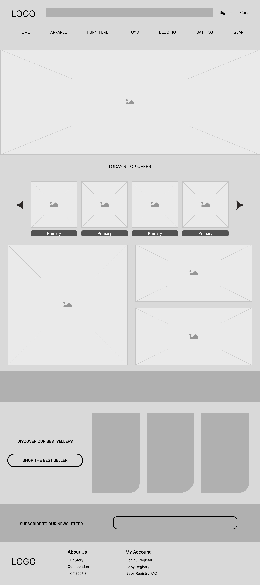
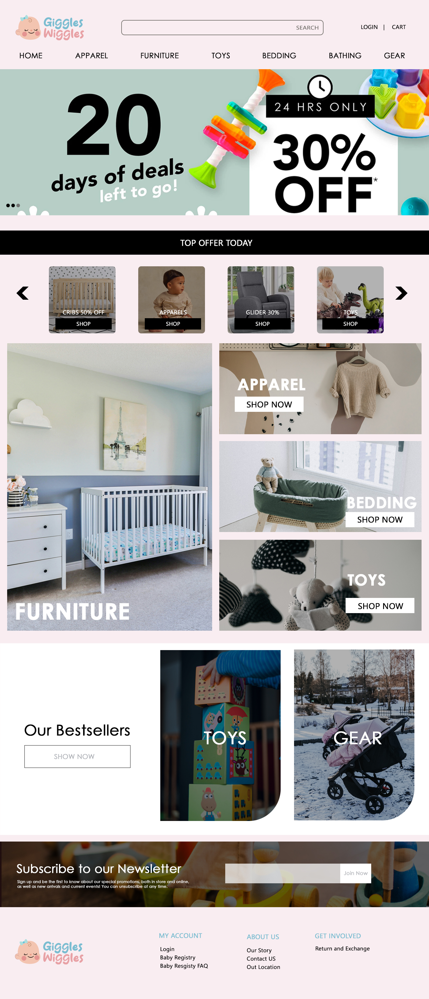
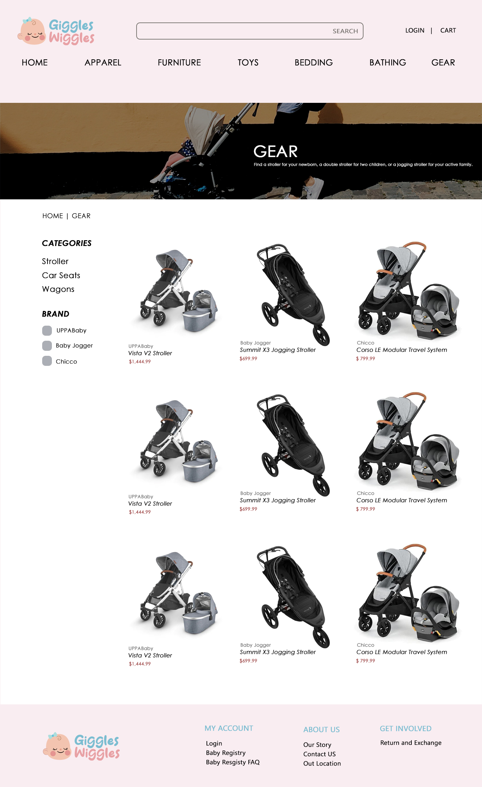
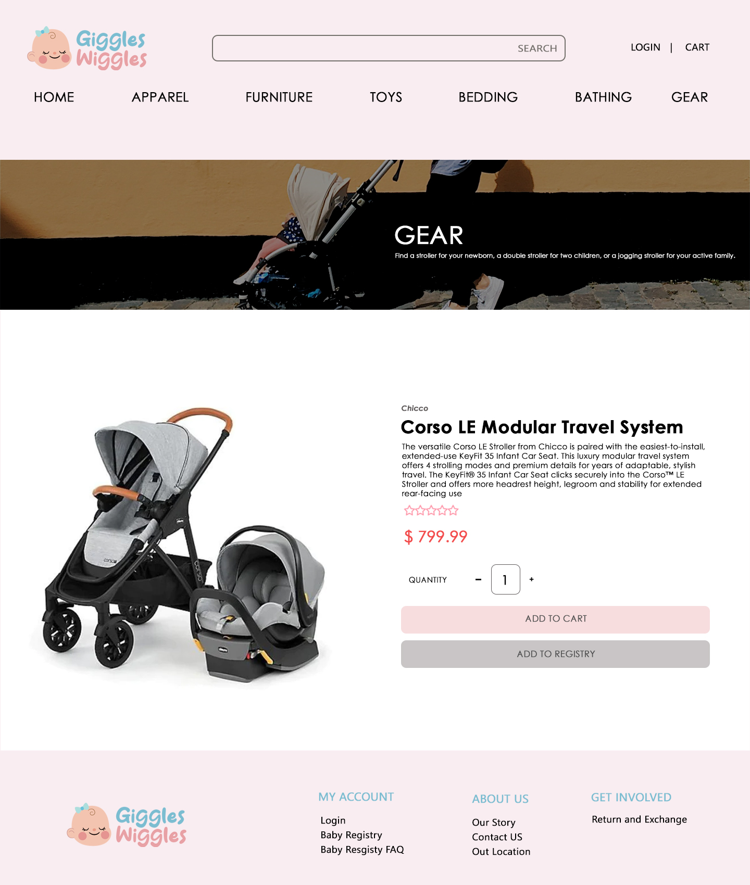
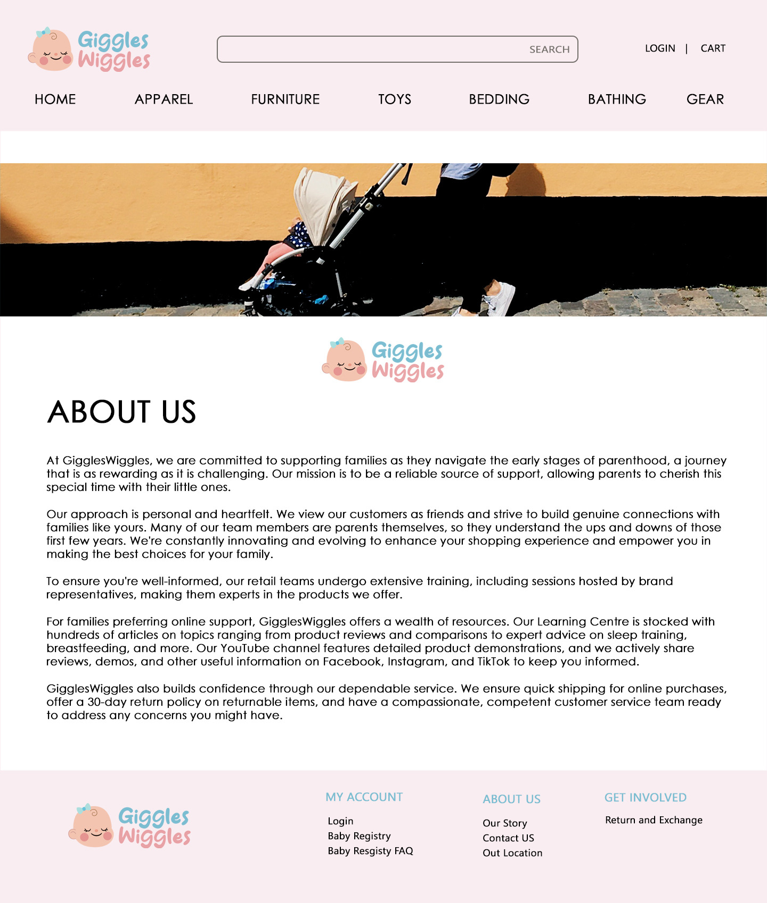
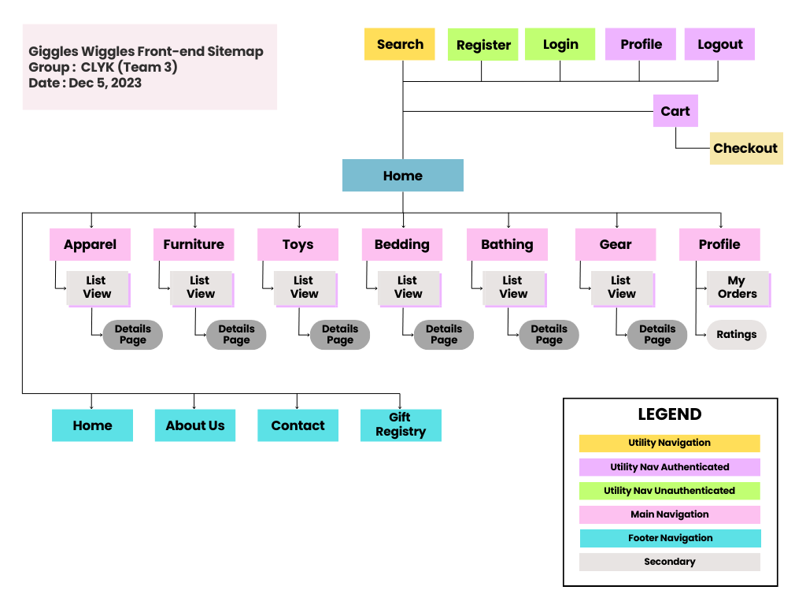
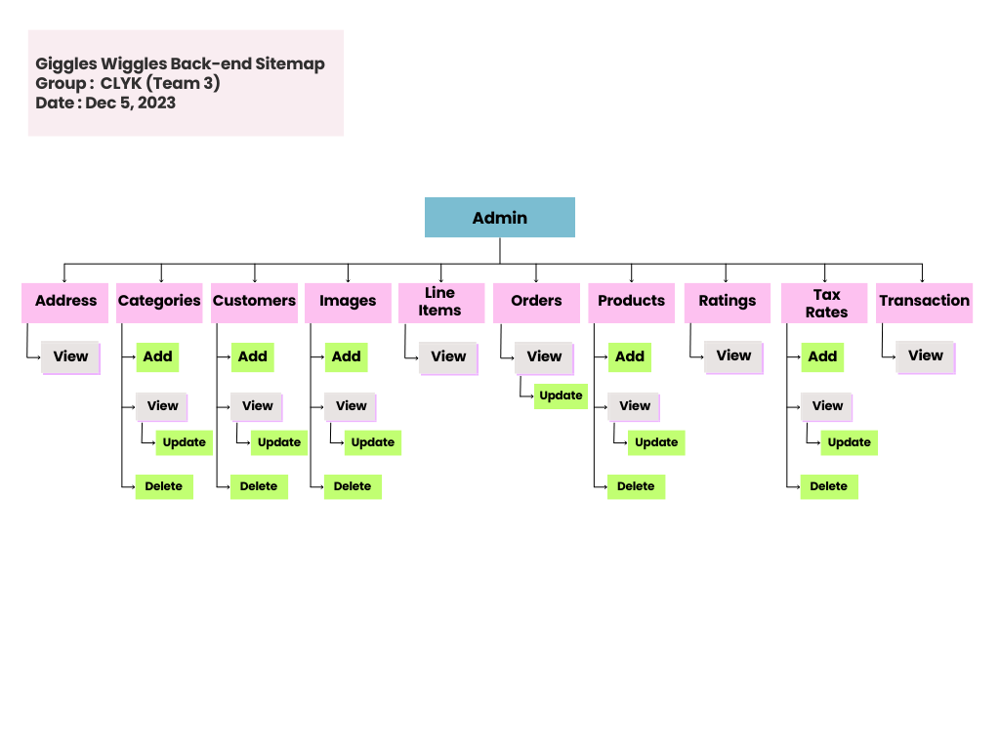
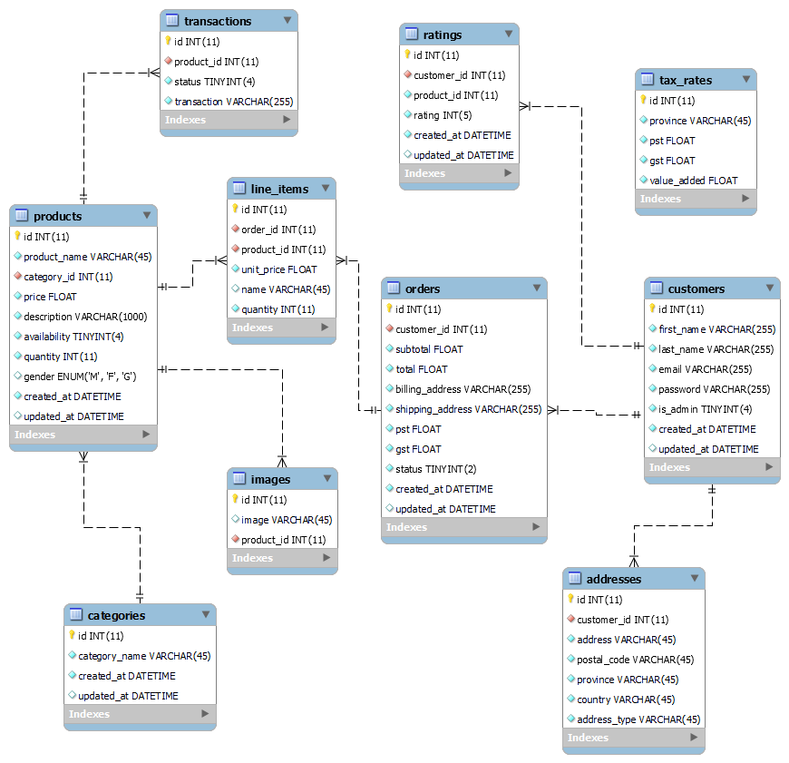

# Proposal Outline

**GigglesWiggles**  
**From:** CLYK  
**To:** Steve George  
**Date:** December 06, 2023

## 1. Description of Your Project

The project involves developing an e-commerce website specializing in baby products, including apparel, furniture, toys, bedding, bathing, and gear. Targeting new parents, the platform aims to provide a seamless shopping experience with user-friendly navigation, detailed product information, and a secure checkout process. Additionally, the site may feature a blog for parenting tips and a community forum, creating a comprehensive and supportive online space for new parents. The goal is to establish a trusted one-stop shop that caters to the diverse needs of new parents, offering both quality products and valuable resources.

## 2. Target Audiences

**Primary Audience: New Parents**  
**Design Choices:** 
- The website's overall design, content, and features prioritize simplicity and ease of use. 
- Clear navigation, intuitive interfaces, and prominently displayed product categories cater to busy and potentially sleep-deprived new parents.

**Secondary Audience: Gift Shoppers (Friends and Family of New Parents)**  
**Design Choices:** 
- Implement a user-friendly gift registry feature to facilitate easy gift selection. 
- Prominent calls-to-action for gift-related categories and personalized gift recommendations enhance the user experience for this audience.

**Tertiary Audience: Parenting Enthusiasts and Community Seekers**  
**Design Choices:** 
- Include a blog with parenting tips, advice, and a community forum tailored to engage parenting enthusiasts. 
- Social sharing options and interactive elements in the forum foster a sense of community and support.

**Influence on Design Choices:**
- **User-Friendly Interface:** 
  - For the primary audience of new parents, the design focuses on simplicity and clarity to ensure a straightforward shopping experience. 
  - Minimalistic design elements reduce cognitive load.

- **Mobile Responsiveness:** 
  - Recognizing that new parents may frequently access the website via mobile devices, a responsive design is crucial. 
  - The website adapts seamlessly to various screen sizes, optimizing the user experience.

- **Personalization Features:** 
  - For gift shoppers, incorporating features like a gift registry and personalized recommendations based on the age of the baby enhances the shopping experience, making it more convenient and thoughtful.

- **Community Building:** 
  - To appeal to parenting enthusiasts and community seekers, the inclusion of a blog and forum fosters a sense of belonging. 
  - Interactive elements, such as commenting and discussion threads, encourage user engagement.

- **Security Measures:** 
  - Given that the primary audience involves parents and caregivers, robust security measures are implemented to safeguard sensitive information, including personal details and transaction data.

## 3. Project Details

### Front-end Functionality:

- **Registration and Authentication:** 
  - Allow users or admins to create accounts, log in, and manage their profiles. 
  - Implement secure authentication mechanisms.

- **Product Catalog:** 
  - Display a comprehensive range of baby products categorized into apparel, furniture, toys, bedding, bathing, and gear. 
  - Include search and filter options for easy navigation.

- **Product Pages:** 
  - Create detailed product pages with images, descriptions, pricing, and customer reviews. 
  - Implement a rating system for users to review and rate products.

- **Shopping Cart and Checkout:** 
  - Enable users to add products to their cart, review items, and proceed to a secure checkout. 
  - Implement a smooth and user-friendly checkout process with multiple payment options.

- **User Dashboard:** 
  - Provide users with a personalized dashboard to track orders, manage preferences, and view past purchases.

- **Responsive Design:** 
  - Ensure the website is accessible and user-friendly across various devices (desktop, tablet, and mobile).

### Back-end Functionality:

- **Product Management:** 
  - Implement a robust system for adding, updating, and managing product information using CRUD operations.

- **Order Processing:** 
  - Develop an order management system to track and process customer orders efficiently.

- **User Management:** 
  - Securely store user profiles and manage account information.

- **Payment Integration:** 
  - Integrate payment gateways to facilitate secure online transactions.

- **Database Management:** 
  - Set up and maintain a database to store product details, user information, and order history.

- **Security Measures:** 
  - Implement security protocols to protect user data, secure transactions, and prevent unauthorized access.

- **Scalability and Performance:** 
  - Design the backend to be scalable to accommodate future growth in terms of products and users. 
  - Optimize performance for a smooth and responsive user experience.

- **Analytics and Reporting:** 
  - Integrate analytics tools to gather insights into user behavior, popular products, and website performance.

## 4. Proposed Design Solution

### Home Page Wireframe ###

 ### Home Page Mock up ###

### List View of the Product Page ###

### Detailed View of the Product Page ###

### Generic Page ###

## 5. User Personas/Use Case Statements

The general front-end user of the GigglesWiggles Website is primarily new parents seeking baby products, gift shoppers looking for presents for new parents, and parenting enthusiasts interested in community engagement and information sharing. The website is designed to cater to their specific needs and offer a seamless and supportive experience, with user-friendly features such as product browsing, gift registry management, parenting community participation, and more. The design choices aim to simplify navigation and enhance the overall experience for these target audiences.

# User Personas and Use Case Statements for GigglesWiggles Website

## Guest User Persona

**Persona Name:** Unauthenticated User

**Description:** The guest user is a potential customer visiting the GigglesWiggles Website without signing in. They are likely expecting a user-friendly experience to explore the products and services the baby store offers.

**Use Case Statement:**

- **Use Case:** Browsing Product Catalog
  - **Description:** As an unauthenticated user, I can browse through the GigglesWiggles Website's product catalog to view various baby products, clothing, furniture, toys, bedding, bathing items, and gear.
  - **Objective:** To discover and explore the range of baby-related products offered by the store.

## Authenticated User Persona

**Persona Name:** New Parent | Authenticated User

**Description:** The authenticated user is a new parent who has created an account on the GigglesWiggles Website. They are looking for products and information related to their baby's needs and are interested in making purchases.

**Use Case Statements:**

- **Use Case:** Adding Products to Cart
  - **Description:** As an authenticated user (new parent), I can browse the product catalog, select products I want to purchase, and add them to my shopping cart.
  - **Objective:** To prepare for the purchase of necessary baby products.

- **Use Case:** Managing Gift Registry
  - **Description:** As an authenticated user (new parent), I can create and manage a gift registry, making it easy for friends and family to select and purchase gifts for my baby.
  - **Objective:** To facilitate gift-giving for special occasions like baby showers or birthdays.

## Admin User Persona

**Persona Name:** Administrator

**Description:** The admin user is responsible for managing and maintaining the GigglesWiggles Website. They have access to administrative tools and features to ensure the smooth operation of the site.

**Use Case Statements:**

- **Use Case:** Managing Product Listings
  - **Description:** As an admin user, I can add, edit, or remove product listings, ensuring that the website's product catalog is up-to-date.
  - **Objective:** To maintain a current and accurate inventory of baby products.

- **Use Case:** Monitoring User Activity
  - **Description:** As an admin user, I can monitor user activity, moderate the parenting community forum, and ensure that the website's content complies with community guidelines.
  - **Objective:** To maintain a safe and supportive online environment for users.

## 6. Sitemaps

**Front-end Sitemap**

**Back-end Sitemap**

## 7. Server

* Operating System: 
    * Ubuntu 22.04.3 LTS

* Software:

    * PHP 8.2.13
    * Apache 2.4.52
    * MariaDB  10.6.12
    * Certbot 1.21.0

## 8. Security

* Application Level:
    * Escape User Inputs: We will use PHP regex expression to filter and validate user's inputs, and also escape special characters when displaying user input.
    * Output Encoding: Encode user-generated content before displaying it in HTML to neutralize scripts, to prevent malicious scripts inserted by the user.
    * CSRF Tokens: We will put unique tokens in forms or requests to verify the request's authenticity to prevent CSRF attacks.
    * Cookies: We will set cookies to `SameSite=Strict` or `SameSite=Lax` to limit cross-origin cookie sharing.
    * Search keywords validation: We will validate and sanitize user search keywords to prevent potential SQL injection.

* Server Level:
    * Enable HTTPS: We will use an SSL Certificate to enable HTTPS protocol to encrypt and protect the communication between users and our server.
    * Enable CDN: We will use a popular CDN service provider to make sure our visitors from all over the world can have a smooth and fast browsing experience.
    * PHP script limiting: We will put a `.user.ini` file inside our document root folder, to make sure all the PHP scripts can be executed ONLY in this folder.
    * Frequently update: We will update our operating system and software (Apache, PHP, MariaDB) to avoid loopholes that could be used by attackers.
    * Web application firewall: We will use a web application firewall to protect our site. For example: we will set a whitelist rule in the firewall for our admin page (Only allow specific IP addresses to access our admin page).

## 9. Value adds

* Use CDN: Our CDN service will speed up website loading times by storing cached content across multiple servers globally. It helps minimize latency by delivering content from servers closer to users, resulting in faster access to website resources and improved user experience.

## 10. Database

* Our database has 10 tables:

  * Customers
    * The authenticated users of the website
  * addresses
    * Both billing and shipping addresses of the customers
  * categories
    * Categories of products
  * images
    * Images for products
  * line_items
    * Specific items listed in orders
  * orders
    * Contains each order placed
  * tax_rates
    * Tax rates for each province
  * products
    * List of products available on the site
  * ratings
    * Customer ratings on products
  * transactions
    * Transaction table for the payment gateway

* Normalization:

We have implemented foreign keys with all qualified tables.
A separate table has been created to hold tax information for each province.
Addresses are in separate tables (customers may have more than one).

## ERD Diagram

## 11. Value adds

We will be implementing a registry:

* Authenticated users can add products to their registry
* If a user is signed in, they can view their registry and edit it
* Possible addition: a link to share with friends/family

## 12. Revised ERD for Value Adds

The value add that we have decided to implement is a gift registry for baby showers. To implement this, we will have to change the following:

* A registry table will be created including a foreign key relating it to the user.
* A separate table will need to be created for the list of items within the registry.

## 13. Our Team

### Kun - Server ###
Kun is responsible for managing and maintaining the server infrastructure. This includes:
- Setting up and configuring servers.
- Ensuring servers run smoothly.
- Handling technical issues related to server performance and security.
Kun is crucial for the team's backend operations.

### Loresa - Database ###
Loresa specializes in database management. Her responsibilities include:
- Designing and maintaining the database system.
- Storing and organizing the team's data.
- Ensuring data integrity, security, and efficiency for effective data access and manipulation.

### Yesha - Programming and Design ###
Yesha is the team's programming expert, responsible for:
- Writing, testing, and maintaining the code that powers software applications or projects.
- Coding, debugging, and implementing new features or functionalities as required.
- Handling the user interface and user-experience along with Cherish

### Cherish - Project Manager and Design ###
Cherish plays a dual role within the team, encompassing:
- **Project Manager:** Overseeing project progress, coordinating tasks, setting deadlines, and ensuring the team stays on track to achieve its goals.
- **Design:** Handling design aspects, including user interface and user experience design, to create an appealing and user-friendly look and feel for the project.

These roles are essential for a well-rounded and efficient team, with each member bringing unique skills and expertise to contribute to the team's success.

